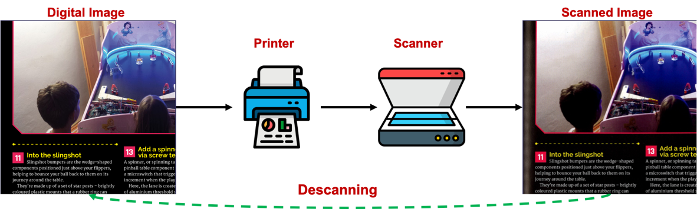
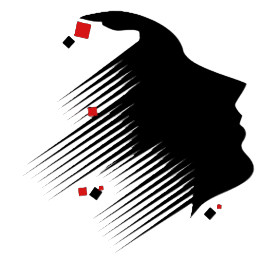

# [AAAI 2024] Descanning: From Scanned to the Original Images with a Color Correction Diffusion Model

[Junghun Cha](https://www.linkedin.com/in/junghun-cha-5a102b1bb/)<sup>1*</sup>, [Ali Haider]()<sup>1*</sup>, [Seoyun Yang](https://kr.linkedin.com/in/seoyun-yang-9b1323218)<sup>1</sup>, [Hoeyeong Jin](https://www.linkedin.com/in/hoeyeong-jin-91987026b/)<sup>1</sup>, [Subin Yang]()<sup>1</sup>, [A. F. M. Shahab Uddin](https://scholar.google.com/citations?user=Ckkj9gQAAAAJ&hl=en)<sup>2</sup>, [Jaehyoung Kim](https://github.com/crux153)<sup>1</sup>, [Soo Ye Kim](https://sites.google.com/view/sooyekim)<sup>3</sup>, [Sung-Ho Bae](https://scholar.google.co.kr/citations?user=EULut5oAAAAJ&hl=ko)<sup>1</sup>

<sup>1</sup> Kyung Hee University, MLVC Lab., Republic of Korea  
<sup>2</sup> Jashore University of Science and Technology, Bangladesh  
<sup>3</sup> Adobe Research, USA  

This repository is the official PyTorch implementation of "Descanning: From Scanned to the Original Images with a Color Correction Diffusion Model".

We will open our dataset DESCAN-18K and pre-trained models as public soon! Please kindly wait for updates.

[[Paper](https://www.arxiv.org/abs/2402.05350)]

## 💾 Dataset: DESCAN-18K


<!--
You can download our dataset DESCAN-18K from these links: [scan1](https://drive.google.com/file/d/1Uanl0NPtVxVOwGb3yzGviopW-j0Gktc6/view?usp=sharing), [scan2](https://drive.google.com/file/d/16DxzIizRdxzrul1T-dgoIzhDn9szFpvK/view?usp=sharing), [clean](https://drive.google.com/file/d/1uB8rFMOjokdYz2ynSPHnxqgqpOAEW707/view?usp=sharing), [validation and test](https://drive.google.com/file/d/12txQIib3ycHcl4f8DscziVtRdN0qZZw1/view?usp=sharing)

After downloading the dataset, please follow detailed instructions [here](https://github.com/jhcha08/Descanning/blob/main/dataset/readme.md).
-->

## 🔭 Requirements

```
python >= 3.8  
torch >= 1.10.2
torchvision >= 0.11.3  
tqdm >= 4.62.2  
numpy >= 1.22.1  
opencv-python >= 4.5.4.60  
natsort >= 8.1.0  
matplotlib >= 3.4.3  
Pillow >= 9.4.0  
scipy >= 1.7.3  
scikit-image >= 0.16.2  
```

```
pip install -r requirements.txt
```

## 💫 Training

To train DescanDiffusion, it is needed to train two modules: Color Encoder and Conditional DDPM.

### Color Encoder (Global Color Correction)

1. Configure settings in ```color_encoder/train_color_encoder.py```. (e.g. dataset path, batch size, epochs).
 - If you want to log the training process, set ```logging=True```.  
2. Execute the below code to train the color encoder.
   ```
   python3 color_encoder/train_color_encoder.py
   ```
3. The last saved model will become ```color_encoder.h5```. It will used to train the conditional DDPM (below part).

### Conditional DDPM (Local Generative Refinement)

1. Configure settings in ```diffusion/train_diffusion.py```. (e.g. dataset path, pre-trained color encoder path, steps).  
 - If you want to log the training process, set ```logging=True```.  
 - If you want to adjust synthetic data generation probability, adjust ```distort_threshold```. (It is 0.25 in the paper).
2. Execute the below code to train the conditional DDPM.
   ```
   python3 diffusion/train_diffusion.py
   ```
3. The last saved model will become ```DescanDiffusion.pth```. It will used to infer scanned images of the testing set.

## 💫 Testing
<!--
**Note:** You can test our DescanDiffusion directly by downloading [pre-trained models](https://drive.google.com/file/d/1neAS5Sh97dlxTFrh9Sn4-kAYvTGVCe0q/view?usp=sharing). 
- ```color_encoder.h5``` & ```DescanDiffusion.pth```
-->

1. Configure settings in ```diffusion/sampling_diffusion.py```. (e.g. testing set path, pre-trained models path, steps).  
2. Execute the below code to test our DescanDiffusion.
   ```
   python3 diffusion/sampling_diffusion.py
   ```
3. The inferred images (i.e., **descanned images**) will be saved into ```test_DescanDiffusion```.

---

## Abstract

A significant volume of analog information, i.e., documents and images, have been digitized in the form of scanned copies for storing, sharing, and/or analyzing in the digital world. However, the quality of such contents is severely degraded by various distortions caused by printing, storing, and scanning processes in the physical world. Although restoring high-quality content from scanned copies has become an indispensable task for many products, it has not been systematically explored, and to the best of our knowledge, no public datasets are available. In this paper, we define this problem as **Descanning** and introduce a new high-quality and large-scale dataset named **DESCAN-18K**. It contains 18K pairs of original and scanned images collected in the wild containing multiple complex degradations. In order to eliminate such complex degradations, we propose a new image restoration model called **DescanDiffusion** consisting of a color encoder that corrects the global color degradation and a conditional denoising diffusion probabilistic model (DDPM) that removes local degradations. To further improve the generalization ability of DescanDiffusion, we also design a synthetic data generation scheme by reproducing prominent degradations in scanned images. We demonstrate that our DescanDiffusion outperforms other baselines including commercial restoration products, objectively and subjectively, via comprehensive experiments and analyses.

## DescanDiffusion Architecture


## Qualitative Comparisons


## News

✨ [2024-03-26] Our codes are released.  
📃 [2024-02-08] Our paper is uploaded on arXiv.  
🎉 [2023-12-09] Our paper is accepted by AAAI 2024.  

## Citation

If this repository is useful to your research, please consider citing our works! 😊

```
@article{cha2024descanning,
        title={Descanning: From Scanned to the Original Images with a Color Correction Diffusion Model},
        author={Cha, Junghun and Haider, Ali and Yang, Seoyun and Jin, Hoeyeong and Yang, Subin
                and Uddin, AFM and Kim, Jaehyoung and Kim, Soo Ye and Bae, Sung-Ho},
        journal={arXiv preprint arXiv:2402.05350},
        year={2024}
}
```

# DESCAN-18K

> **DESCAN-18K** is a dataset for the **descanning** task. This dataset contains **18,360 paired real scanned/original images** for recovering original digital images from their real scanned counterparts.

[](https://arxiv.org/pdf/2402.05350)
[](https://arxiv.org/abs/2402.05350)
[](https://huggingface.co/datasets/ENCLab/DESCAN-18K)

---

## Table of Contents

1. [Overview](#overview)
2. [Descanning Process](#descanning-process-overview)
3. [Dataset Statistics](#dataset-statistics)
4. [Scanner IDs](#scanner-ids)
5. [Data Structure](#data-structure)
6. [File Naming](#file-naming)
7. [Source and Construction](#source-and-construction)
8. [Degradation Types](#degradation-types)
9. [Intended Use](#intended-use)
10. [Benchmark Results](#reported-benchmark-results)
11. [Dataset Link](#dataset-link)
12. [Citation](#citation)
13. [References](#references)
14. [License](#license-and-redistribution-note)

---

## Overview

**DESCAN-18K** is a dataset for the **descanning** task: recovering the original digital image from a real scanned page. This dataset supports that task with large-scale **real scanned/original pairs** collected from real scanners and original digital pages.

DESCAN-18K's key characteristics:

- **Real paired data**: each `scan/clean` pair comes from a real scanned page and its corresponding original digital page
- **New task setting**: the work explicitly defines **descanning** as its own restoration problem
- **Cross-scanner evaluation**: the test set uses scanner models not seen during training
- **Mixed degradations**: color distortion, bleed-through, halftone, texture distortion, and scanner noise often co-occur
- **Scale**: `18,360` aligned pairs across four real-world scanners
- **Format**: RGB TIFF images at `1024 x 1024`
- **Content diversity**: photographs, graphics, layouts, and text-heavy magazine pages

Each sample contains:

| Folder | Contents |
| --- | --- |
| `scan/` | Real scanned page image (model input) |
| `clean/` | Corresponding original digital page image (target) |

The core dataset consists of **real scanned/original pairs**. Synthetic data appears in the paper only as an additional training augmentation strategy for the `DescanDiffusion+` model variant.


---

## Descanning Process Overview

The figure below shows the descanning process: a digital image is printed, scanned, and then restored back toward its original digital form through descanning.



---

## Dataset Statistics

The table below follows the **paper-reported** split sizes.

| Split | Scanners | Paper-Reported Pairs |
| --- | --- | ---: |
| Train | scanner3, scanner4 | 17,640 |
| Valid | scanner3, scanner4 | 360 |
| Test | scanner1, scanner2 | 360 |
| **Total** | - | **18,360** |


---

## Scanner IDs

| ID | Scanner Model | Split |
| --- | --- | --- |
| scanner1 | Fuji Xerox ApeosPort C2060 | Test only |
| scanner2 | Canon imagePRESS C650 | Test only |
| scanner3 | Canon imageRUNNER ADVANCE 6265 | Train / Valid |
| scanner4 | Plustek OpticBook 4800 | Train / Valid |

Training and validation use `scanner3` and `scanner4`. The test set uses `scanner1` and `scanner2`, which are unseen during training and therefore support cross-scanner generalization evaluation.

---

## Data Structure

```text
DESCAN-18K-dataset/
|-- Train/
|   |-- scan/    # real scanned page images used as model inputs
|   `-- clean/   # aligned original digital target images
|-- Valid/
|   |-- scan/    # validation scanned images
|   `-- clean/   # validation original targets
|-- Test/
|   |-- scan/    # unseen-scanner scanned images for evaluation
|   `-- clean/   # corresponding original targets
`-- README.md
```

Each file in `scan/` has a same-named counterpart in `clean/`.

| Path | Role |
| --- | --- |
| `Train/scan` | Degraded real scanned inputs for training |
| `Train/clean` | Paired original digital targets for training |
| `Valid/scan` | Scanned validation inputs |
| `Valid/clean` | Paired validation targets |
| `Test/scan` | Scanned test inputs from unseen scanners |
| `Test/clean` | Paired test targets |

---

## File Naming

| Split | Convention | Example |
| --- | --- | --- |
| `Train/` | Source-document style | `BookOfMaking.00001.01.tif` |
| `Valid/` | Scanner-based | `scanner03_000.tif` |
| `Test/` | Scanner-based | `scanner01_000.tif` |

All images are stored as TIFF files (`.tif`).

---

## Source and Construction

According to the paper, DESCAN-18K was built from **11 magazine types** from the Raspberry Pi Foundation, licensed under `CC BY-NC-SA 3.0`. The pages contain diverse image and text content and had preservation durations ranging from a few days to seven years.

The paper describes the construction pipeline as follows:

1. Magazine pages were manually scanned with four scanner models.
2. Corresponding original PDF pages were collected online.
3. Both scanned and original data were converted to RGB TIFF.
4. Page pairs were aligned with **AKAZE** registration.
5. Poor matches were manually filtered.
6. The aligned pages were randomly cropped to `1024 x 1024`.
7. The cropped pairs were registered again with AKAZE to secure aligned patch pairs.

The paper also states that scanned TIFF images were calibrated under the **IT 8.7 / ISO 12641** standard.

---

## Degradation Types

The paper identifies six representative degradation types in DESCAN-18K. These often appear in combination within the same sample.

| # | Degradation | Description from the paper |
| --- | --- | --- |
| 1 | Color transition | Global color fading, saturation change, or altered color tone |
| 2 | External noise | Dots or localized stains caused by foreign substances |
| 3 | Internal noise | Scanner-generated crumpled, curved, or laser-like artifacts |
| 4 | Bleed-through effect | Back-page contents becoming visible in the scan |
| 5 | Texture distortion | Global physical textures or wrinkle-like artifacts |
| 6 | Halftone pattern | Printing-induced CMYK dot structures |

---

## Intended Use

DESCAN-18K is intended for **paired descanning research and evaluation**:

- **Input:** scanned image from `scan/`
- **Target:** original image from `clean/`

It can be used for developing, benchmarking, and analyzing methods that recover original digital images from real scanned pages. The scanner-based split is especially useful for evaluating generalization to unseen scanner types.

Why this dataset matters:

- It is built from **real scanned pages**, not only synthetic corruption pipelines.
- It provides direct **paired supervision** between scanned inputs and original digital targets.
- It explicitly supports the newly defined **descanning** task.
- It includes a test split from unseen scanner models.

---

## Reported Benchmark Results

The following results are reported in **Table 1 of the paper** on the original DESCAN-18K testing set.

| Method | PSNR (dB) | SSIM | LPIPS | FID |
| --- | ---: | ---: | ---: | ---: |
| Pix2PixHD | 20.58 | 0.8014 | 0.057 | 18.30 |
| CycleGAN | 21.52 | 0.8417 | 0.050 | 16.99 |
| HDRUNet | 20.90 | 0.8480 | 0.055 | 16.42 |
| Restormer | 20.37 | 0.7915 | 0.152 | 25.57 |
| ESDNet | 21.22 | 0.8418 | 0.088 | 15.24 |
| NAFNet | 22.03 | 0.8538 | 0.048 | 16.00 |
| OPR* | 18.09 | 0.7249 | 0.158 | 21.45 |
| DPS* | 17.93 | 0.7354 | 0.150 | 41.64 |
| Clear Scan | 21.46 | 0.8183 | 0.054 | 18.09 |
| Adobe Scan | 15.80 | 0.6153 | 0.141 | 23.55 |
| Microsoft Lens | 20.48 | 0.8013 | 0.056 | 18.97 |
| DescanDiffusion | 23.40 | 0.8717 | **0.042** | **13.51** |
| DescanDiffusion+ | **23.43** | **0.8736** | 0.044 | 14.60 |

`*` Methods with an asterisk are official pre-trained versions used by the paper authors.

The paper states that the DescanDiffusion variants outperform competing methods and commercial products on the DESCAN-18K test set. Within Table 1, `DescanDiffusion+` has the best PSNR and SSIM, while `DescanDiffusion` has the best LPIPS and FID.

---

## Dataset Link

- Hugging Face: https://huggingface.co/datasets/ENCLab/DESCAN-18K


## Citation

If you use DESCAN-18K in your research, please cite:

```bibtex
@article{cha2024descanning,
  title={Descanning: From Scanned to the Original Images with a Color Correction Diffusion Model},
  author={Cha, Junghun and Haider, Ali and Yang, Seoyun and Jin, Hoeyeong and Yang, Subin
          and Uddin, AFM and Kim, Jaehyoung and Kim, Soo Ye and Bae, Sung-Ho},
  journal={arXiv preprint arXiv:2402.05350},
  year={2024}
}
```

---

## References

| Resource | Link |
| --- | --- |
| Paper | https://arxiv.org/abs/2402.05350 |
| Code | https://github.com/jhcha08/Descanning |
| Dataset | https://huggingface.co/datasets/ENCLab/DESCAN-18K |
| Lab | https://mlvc.khu.ac.kr/ |



---
